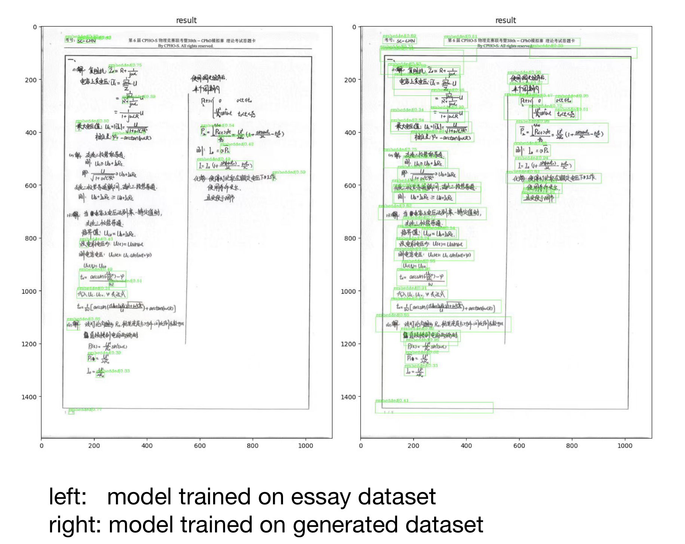
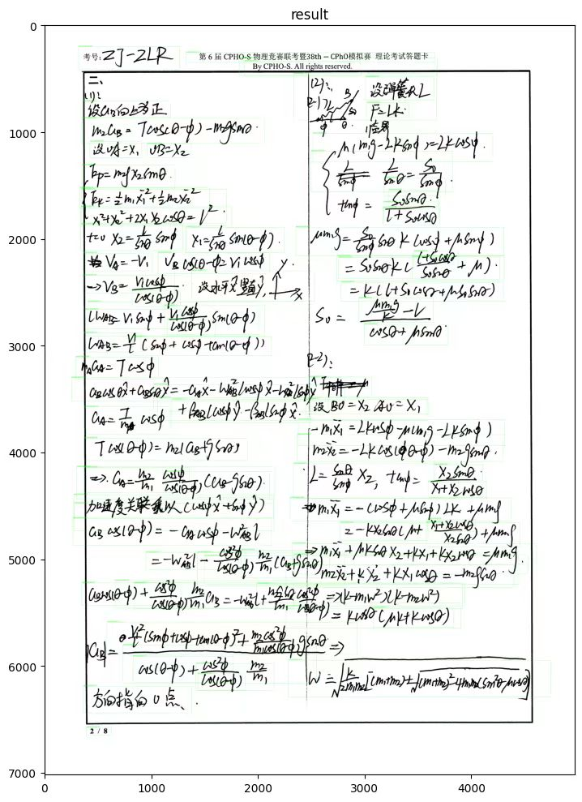
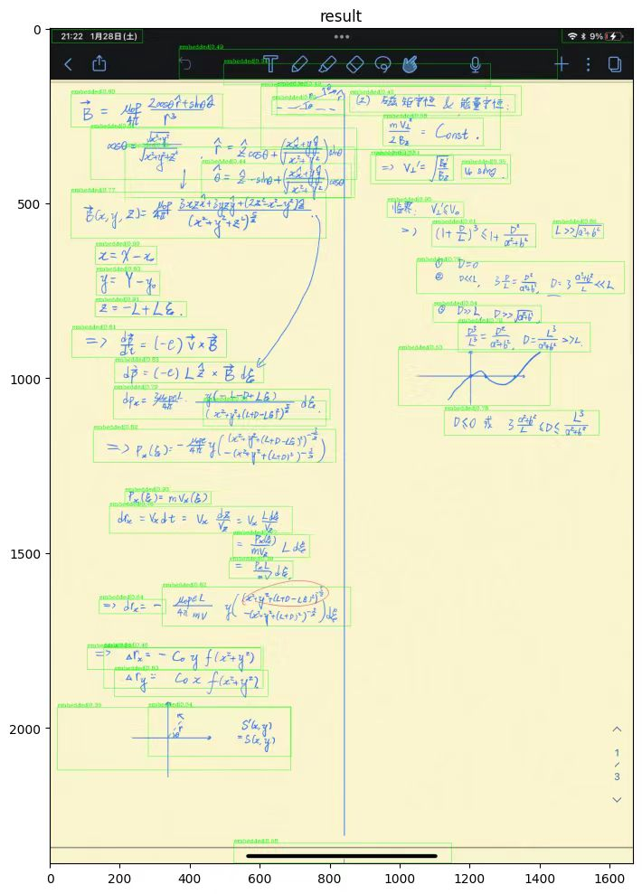

# CPHOSS_MFD
A repo for math formula detection used in the AI Grading project called Centralized Physics Olympiad Scoring System.


# Summary
This repository is based on https://github.com/Yuxiang1995/ICDAR2021_MFD. Same model is used, and the dataset used in that repository is used to generate a new dataset for MFD in the case for answer sheet. The contribution of this repository can be concluded as following:

Previous MFD (Math Formula Detection) tasks mainly focus on detecting math formulas in essays. In these essays the formulas may be embedded in paragraphs of texts. However in this case of AI Grading for Physics Olympiad, a common case is that there are many formulas lying on the answer sheet with no or very few texts. In other word this is not similar to the training set provided by the essay dataset. Thus models trained on the essay dataset perform poorly in this test case.

The repo's contribution is that it **provides a way to generate a new dataset suitable for MFD used in grading answer sheets based on the essay dataset**. The main idea is like **CAP** (Cut and Paste), an Augmentation method usually used in 3D-object detection. That is, I cut the formulas in the essay dataset, then paste them at random onto a white paper with scaling or rotation as an augmentation method. Models trained on this generated new dataset can perform very well in this test case.

# Usage
The use is almost the same to https://github.com/Yuxiang1995/ICDAR2021_MFD, except for the preprocessing part. For preprocessing, you need to run the preprocessing of the original essay dataset first, then you need to run `tools/data_preprocess_CAP.py` for each directory of the dataset. In this python file you can set hyperparameters such as max rotation angle for one formula, min w_h ratio for one formula to be pasted, the range of scaling augmentation, the range number of formulas, max iou and iom, etc for the CAP generating process.


# Examples
Here I provide some examples, showing the effectness of this method to generate dataset and the adaptation ability of models trained on this dataset to different conditions.

Example 1: a comparision of models trained on original essay dataset and models trained on generated dataset.



Example 2 and Example 3: the model trained on new dataset performs well on this test cases.




# Citations
```shell
@article{zhong20211st,
  title={1st Place Solution for ICDAR 2021 Competition on Mathematical Formula Detection},
  author={Zhong, Yuxiang and Qi, Xianbiao and Li, Shanjun and Gu, Dengyi and Chen, Yihao and Ning, Peiyang and Xiao, Rong},
  jthisnal={arXiv preprint arXiv:2107.05534},
  year={2021}
}
